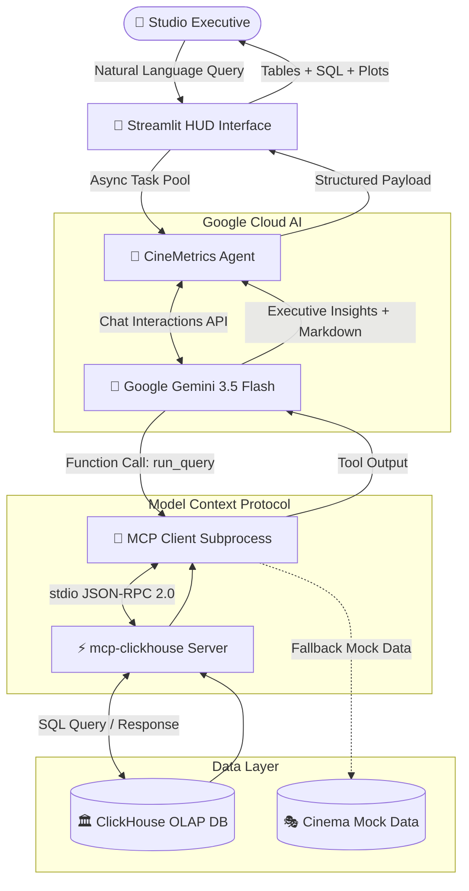

# CineMetrics AI 🎬⚡
### *Next-Gen Autonomous Box Office Intelligence & Marketing Analytics*

[](./LICENSE)
[](https://python.org)
[](https://ai.google.dev)
[](https://modelcontextprotocol.io)
[](https://clickhouse.com)
[](https://streamlit.io)
[](#-internationalization-i18n)

---

## 🌟 Overview

**CineMetrics AI** is an agentic, conversational business intelligence platform built for film studio executives, theatrical distributors, and entertainment marketers. 

Powered by **Google Gemini** and integrated with **ClickHouse** via the **Model Context Protocol (MCP)**, the platform turns complex analytical questions about box office performance, audience sentiment, and marketing ROI into precise ClickHouse SQL queries in real time—delivering actionable executive summaries, tabular data, and interactive holographic visualizations.

---

## 📸 Holographic HUD Interface

Designed with a futuristic **Cyberpunk / Holographic HUD** aesthetic featuring dark themes, neon glow accents, real-time KPI tickers, and interactive Plotly visualizations.

* **Global Box Office & Weekly Momentum:** Dynamic trend lines with spline curves and automated peak annotations.
* **Audience Engagement & Demographics:** Multi-segment donut charts and satisfaction indicators.
* **Real-Time Traffic & Sentiment Heatmaps:** Live viewer metrics and dual-stream social buzz tracking (*Hype* vs. *Critical Acclaim*).
* **AI Predictions & Release Radar:** Predictive analytics and upcoming release readiness tracking.

---

## 🏗️ Architecture & Agent Flow

CineMetrics AI operates on an autonomous **ReAct (Reasoning + Acting)** multi-turn loop utilizing the official **Google GenAI SDK** (`google-genai` v1.x) and **ClickHouse MCP Server** (`mcp-clickhouse`).



---

## 🚀 Key Features

* **🧠 Natural Language to High-Performance SQL:** Translates business queries (e.g., *"Which format earns higher revenue: IMAX or 3D?"*) into optimized ClickHouse analytical queries with aggregates, group-bys, and temporal filters.
* **⚡ Native MCP Runtime Integration:** Spawns and communicates with the official `mcp-clickhouse` server over `stdio` streams using JSON-RPC 2.0 without requiring custom database drivers in the agent layer.
* **🔄 Autonomous Multi-Turn ReAct Loop:** If a query requires exploring schemas or multiple steps (e.g., listing tables then querying aggregations), the agent resolves dependencies autonomously up to 5 steps.
* **🌐 Bilingual Support (ES / EN):** One-click toggle switch between English and Spanish across all dashboard elements, metric cards, charts, and agent system prompts.
* **🛡️ Production-Grade Error Resilience:**
  * **Exponential Backoff:** Automatically handles transient Google AI demand spikes (`503 UNAVAILABLE` / `429 Rate Limits`).
  * **Event Loop Isolation:** Operates on isolated worker event loops preventing thread contention in Streamlit.
  * **Smart Fallback:** Gracefully falls back to mock demo data if a local ClickHouse server is not running.
* **🔍 Full Analytical Transparency:** Inspect the exact SQL query generated by Gemini alongside execution metadata and raw data tables.

---

## 🏆 Hackathon Compliance Checklist

| Rule / Requirement | Status | Implementation Details |
|---|:---:|---|
| **Google Cloud AI Only** | ✅ | Built exclusively with `google-genai` (Gemini 3.5 Flash). Strictly **zero** OpenAI/Anthropic dependencies. |
| **Runtime MCP Integration** | ✅ | Uses official `mcp` SDK and launches `mcp-clickhouse` via standard input/output. |
| **Open Source** | ✅ | Licensed under permissive **MIT License**. |
| **Python Backend + Streamlit** | ✅ | Clean, modular Python 3.11+ architecture with interactive Streamlit UI. |

---

## 📦 Project Structure

```
cinemetrics-ai/
├── app.py              # 🎨 Streamlit Web Application (HUD Theme & Dashboard)
├── agent.py            # 🤖 Gemini Multi-Turn ReAct Agent (Interactions API)
├── mcp_client.py       # 🔌 ClickHouse MCP Client & Subprocess Manager
├── config.py           # ⚙️  Centralized Pydantic Configuration & .env Validation
├── requirements.txt    # 📦 Python Dependencies
├── .env.example        # 🔐 Environment Variables Template
├── .gitignore          # 🚫 Git Exclusions (.env, .venv, caches)
├── LICENSE             # 📄 MIT Open Source License
└── README.md           # 📖 Documentation & Setup Guide
```

---

## 🛠️ Getting Started

### Prerequisites

* **Python 3.11+** installed.
* A **Google AI Studio API Key** ([Get free key here](https://aistudio.google.com/app/apikey)).
* *(Optional)* Docker or a running ClickHouse database instance.

### 1. Clone the Repository

```bash
git clone https://github.com/tu-usuario/cinemetrics-ai.git
cd cinemetrics-ai
```

### 2. Create Virtual Environment & Install Dependencies

```bash
# Create virtual environment
python -m venv .venv

# Activate environment
# On Windows (PowerShell):
.venv\Scripts\Activate.ps1
# On Linux / macOS:
source .venv/bin/activate

# Install dependencies
pip install -r requirements.txt
```

### 3. Configure Environment Variables

```bash
cp .env.example .env
```

Open `.env` in your editor and add your Google API key:

```env
GOOGLE_API_KEY=AIzaSy...your_real_key_here
GEMINI_MODEL=gemini-3.5-flash
```

### 4. Run the Application

```bash
streamlit run app.py
```

The application will open automatically at `http://localhost:8501`.

---

## 🗄️ ClickHouse Database Setup (Optional for Live Mode)

If you wish to test with live ClickHouse database tables instead of the built-in demo mode:

### Start ClickHouse via Docker

```bash
docker run -d \
  --name clickhouse-cinemetrics \
  -p 8123:8123 \
  -p 9000:9000 \
  clickhouse/clickhouse-server:latest
```

### Seed Analytical Tables

```sql
CREATE DATABASE IF NOT EXISTS cinemetrics;

-- Box office & ticketing data
CREATE TABLE cinemetrics.tickets (
    date         Date,
    movie_id     UInt32,
    country      LowCardinality(String),
    region       String,
    format       LowCardinality(String), -- IMAX, 3D, Standard
    tickets_sold UInt64,
    revenue_eur  Decimal64(2)
) ENGINE = MergeTree()
ORDER BY (date, country, movie_id);

-- Marketing campaign performance
CREATE TABLE cinemetrics.marketing_campaigns (
    campaign_id            UInt32,
    movie_id               UInt32,
    channel                LowCardinality(String), -- Digital, TV, Outdoor, Social
    spend_eur              Decimal64(2),
    attributed_revenue_eur Decimal64(2),
    impressions            UInt64,
    clicks                 UInt64
) ENGINE = MergeTree()
ORDER BY (campaign_id, channel);
```

---

## ⚙️ Environment Variables Reference

| Variable | Type | Default | Description |
|---|:---:|:---:|---|
| `GOOGLE_API_KEY` | String | *Required* | API Key from Google AI Studio. |
| `GEMINI_MODEL` | String | `gemini-3.5-flash` | Gemini model ID (`gemini-3.5-flash`, `gemini-3.1-flash-lite`). |
| `CLICKHOUSE_HOST` | String | `localhost` | ClickHouse host address. |
| `CLICKHOUSE_PORT` | Integer | `8123` | ClickHouse HTTP port (8123 or 8443 for HTTPS). |
| `CLICKHOUSE_USER` | String | `default` | Database user name. |
| `CLICKHOUSE_PASSWORD` | String | `""` | Database password. |
| `CLICKHOUSE_DATABASE` | String | `cinemetrics` | Default database schema name. |
| `CLICKHOUSE_USE_SSL` | Boolean | `false` | Enable TLS/SSL connection (for ClickHouse Cloud). |
| `MCP_SERVER_COMMAND` | String | `uvx` | Command to spawn MCP server (`uvx` or `mcp-clickhouse`). |

---

## 🌐 Internationalization (i18n)

CineMetrics AI includes full bilingual support (**Spanish 🇪🇸** and **English 🇬🇧**):
* Real-time header language switcher.
* Dynamically localized Plotly labels, KPI text, and tooltips.
* Context-aware prompt instructions adjusting the agent's conversational output.

---

## 📄 License

This project is licensed under the **MIT License** — see the [LICENSE](./LICENSE) file for details.

---

<div align="center">
  <sub>Built with ❤️ for the Agentic Cinema Hackathon · Powered by Google Gemini & ClickHouse MCP</sub>
</div>
